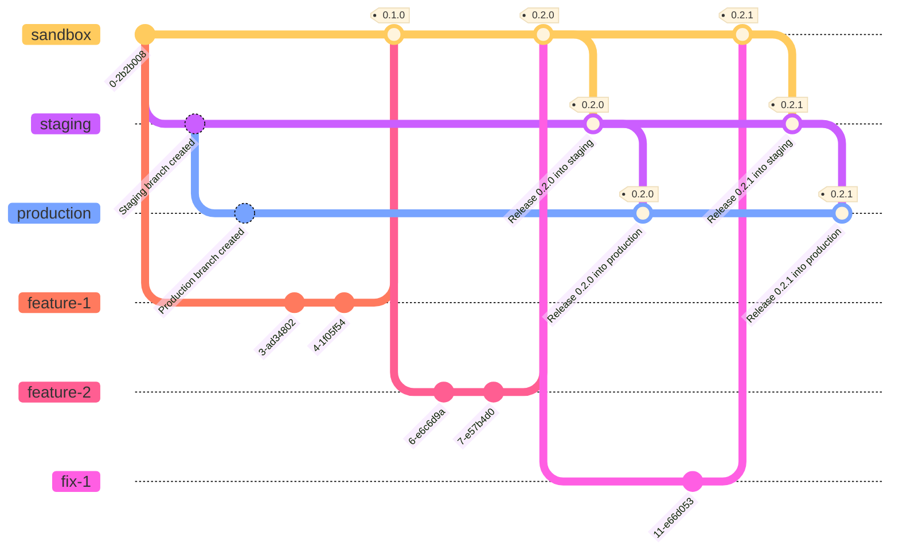

# Repository Conventions

## Git conventions

### Commits

For commits the team will use [Conventional Commit](https://www.conventionalcommits.org/en/v1.0.0/) conventions. We will use the Angular convention for now, but may look at a more appropriate convention in the future.

By following this convention, our commits should easier to scan, easier to understand when reviewing, and allow for easier implementation of automatic versioning via CI/CD.

This standard should also satisfy the [Dissemination Engineering Standards](https://github.com/ONSdigital/dp-standards/blob/main/COMMIT_STANDARDS.md) standards.

### Branches 

#### Branching strategy

Our branching strategy is based off [GitLab Flow](https://medium.com/novai-devops-101/top-4-branching-strategies-and-their-comparison-a-guide-with-recommendations-21071e1c472a).

Our default branch is called `sandbox`, which also serves as the branch for our `sandbox` environment.



#### Branch naming

The team will follow a consistent naming convention for their branches, which will be based off the conventional commit standard, and general standard practices.

The names will be in the format: `<TYPE>/<TICKET ID>/<DESCRIPTION OF TICKET>`. For example:

```
feat/1234/adding-api-integration
fix/9876/broken-api-integration
```

This should ensure that:
1. It is easy to tell what a branch does from name alone
2. It is easy to tell what ticket the branch is regarding from the name alone
3. CI/CD pipelines can be setup to work on specific types of branches if needed (e.g. "only run on PRs from feature branches")

### PRs

PRs will also use the Conventional Commit format convention, for the same reasons as described previously. The team will also put the user story number for the work as the scope for the PR name.

E.g. for user story `1234`, the PR might be titled `feat(1234): Add support for new metadata format`.