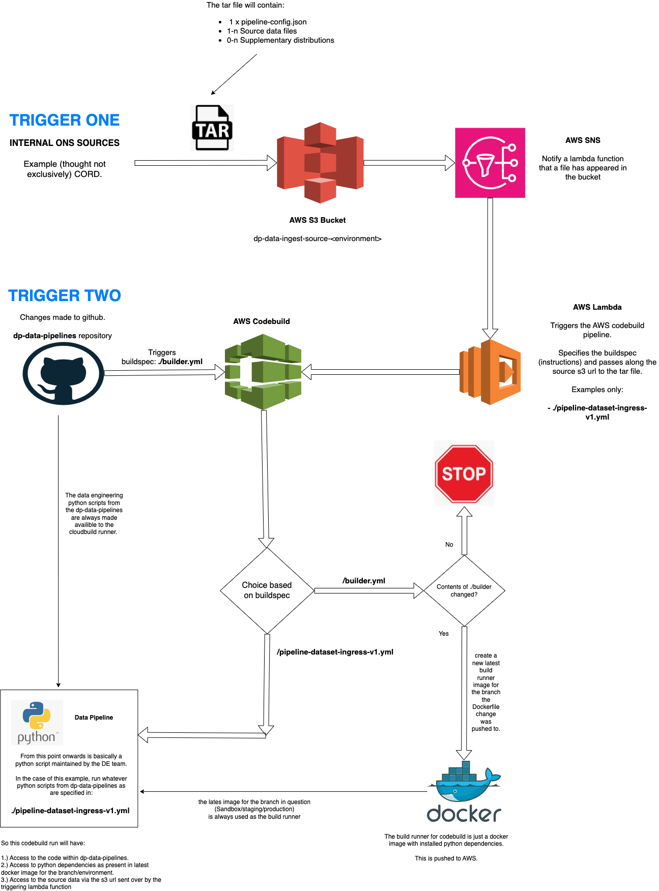

**WORK IN PROGRESS - DO NOT USE**

# dp-data-pipelines

Pipeline specific python scripts and tooling for automated website data ingress.

There are two things to understand here:

- Architecture
- Implementation

We'll take each in turn then discuss repository structure.


### Architecture

The following diagram shows a simple overview of how this repository is used to manage variants of simple data pipelines for the purpose of shunting data assets from outside the websites services to within - via submissions to an aws s3 bucket.

Note - This is a high level diagram only of _how_ we run pipeline**s** (as in, the usage of this github repo and how it interacts with infrastructure) to contextualise the code present rather than a strict architectural diagram.

_How_ the pipelines mentioned below actually work is covered in the following _Implementation_ section.




### Implementation

This system works as follow:

- The lambda triggers a buildspec, for an example lets use [pipeline-dataset-ingress.v1.yml](./pipeline-dataset-ingress-v1.yml)
- This particular buildspec triggers a python pipeline of [./pipeline/dataset_ingress_v1.py](./pipeline/dataset_ingress_v1.py)
- The pipeline will have an s3 url which will be decompressed to the working dir, it provides:
     - source data
     - configuration options (such as which "transform" script to be applied to the source data)

For specific details using the above example please see:

- 1.) [The ingress v1 pipeline-config.json readme](./docs/pipeline-config.md).
- 2.) [The dataset ingress v1 pipeline code readme](./pipeline/README.md)
- 3.) [The pipeline-dataset-ingress.v1.yml buildspec](./pipeline-dataset-ingress-v1.yml)


## Repository Structure

The following is the (initially, it'll expand over time) structure of this repository, **this does not need to be kept up to date with every change** - it's intended to help explain how the triggering logic for this repo works.

```
- /dp-data-pipelines
     - /schemas
     - /builder                           # Contains Dockerfile for image
     - /pipelines
          - s3_tar_received.py            # Uses contents of tar to decide wbich /pipeline/* to call
          - pipeline
               - /shared
               - dataset_ingress_v1.py
     - /tests
     - /features
     - s3_tar_received.yml                # Calls ./pipelines/s3_tar_recieved.py. Triggered by lambda
     - builder.yml                        # Rebuilds /builder/Dockerfile on changes to that directory
```
