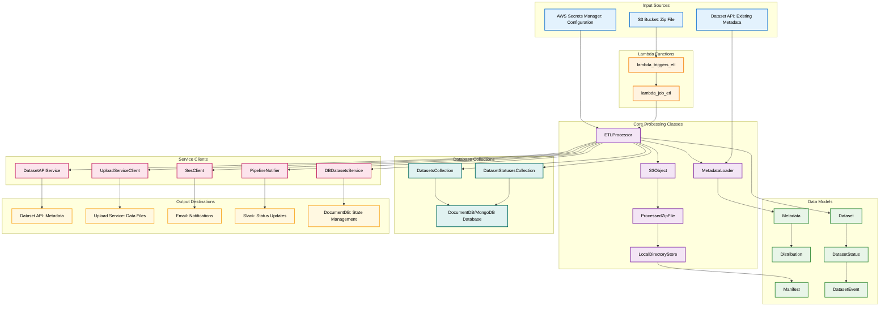

# Data flow and component architecture

```mermaid
graph TD
    subgraph "Input Sources"
        S3Input[S3 Bucket: Zip File]
        Secrets[AWS Secrets Manager: Configuration]
        DatasetApi[Dataset API: Existing Metadata]
    end

    subgraph "Lambda Functions"
        TriggerLambda[lambda_triggers_etl]
        ETLLambda[lambda_job_etl]
    end

    subgraph "Core Processing Classes"
        ETLProcessor[ETLProcessor]
        S3Obj[S3Object]
        ZipFile[ProcessedZipFile]
        MetadataLoader[MetadataLoader]
        LocalDirStore[LocalDirectoryStore]
    end

    subgraph "Data Models"
        Manifest[Manifest]
        Metadata[Metadata]
        Distribution[Distribution]
        Dataset[Dataset]
        DatasetStatus[DatasetStatus]
        DatasetEvent[DatasetEvent]
    end

    subgraph "Service Clients"
        DatasetAPIService[DatasetAPIService]
        UploadServiceClient[UploadServiceClient]
        SesClient[SesClient]
        PipelineNotifier[PipelineNotifier]
        DBDatasetsService[DBDatasetsService]
    end

    subgraph "Database Collections"
        DatasetsCollection[DatasetsCollection]
        DatasetStatusesCollection[DatasetStatusesCollection]
        Database[DocumentDB/MongoDB Database]
    end

    subgraph "Output Destinations"
        DatasetAPI[Dataset API: Metadata]
        UploadService[Upload Service: Data Files]
        Emails[Email: Notifications]
        Slack[Slack: Status Updates]
        DocumentDB[DocumentDB: State Management]
    end

    %% Flow connections
    S3Input --> TriggerLambda
    TriggerLambda --> ETLLambda
    Secrets --> ETLProcessor
    ETLLambda --> ETLProcessor

    ETLProcessor --> S3Obj
    S3Obj --> ZipFile
    ETLProcessor --> MetadataLoader
    ZipFile --> LocalDirStore

    LocalDirStore --> Manifest
    MetadataLoader --> Metadata
    Metadata --> Distribution

    ETLProcessor--> Dataset
    Dataset --> DatasetStatus
    DatasetStatus --> DatasetEvent

    ETLProcessor--> DatasetAPIService
    ETLProcessor--> UploadServiceClient
    ETLProcessor--> SesClient
    ETLProcessor--> PipelineNotifier
    ETLProcessor--> DBDatasetsService

    ETLProcessor--> DatasetsCollection
    ETLProcessor--> DatasetStatusesCollection
    DatasetsCollection --> Database
    DatasetStatusesCollection --> Database

    DatasetAPIService --> DatasetAPI
    UploadServiceClient --> UploadService
    SesClient --> Emails
    PipelineNotifier --> Slack
    DBDatasetsService --> DocumentDB

    %% Data flow for success path
    DatasetApi --> MetadataLoader

    %% Styling
    classDef input fill:#e3f2fd,stroke:#1976d2,stroke-width:2px,color:black
    classDef lambda fill:#fff3e0,stroke:#f57c00,stroke-width:2px,color:black
    classDef core fill:#f3e5f5,stroke:#7b1fa2,stroke-width:2px,color:black
    classDef model fill:#e8f5e8,stroke:#388e3c,stroke-width:2px,color:black
    classDef service fill:#fce4ec,stroke:#c2185b,stroke-width:2px,color:black
    classDef db fill:#e0f2f1,stroke:#00695c,stroke-width:2px,color:black
    classDef output fill:#fff8e1,stroke:#f9a825,stroke-width:2px,color:black

    class S3Input,Secrets,DatasetApi input
    class TriggerLambda,ETLLambda lambda
    class ETLProcessor,S3Obj,ZipFile,MetadataLoader,LocalDirStore core
    class Manifest,Metadata,Distribution,Dataset,DatasetStatus,DatasetEvent model
    class DatasetAPIService,UploadServiceClient,SesClient,PipelineNotifier,DBDatasetsService service
    class DatasetsCollection,DatasetStatusesCollection,Database db
    class DatasetAPI,UploadService,Emails,Slack,DocumentDB output
```