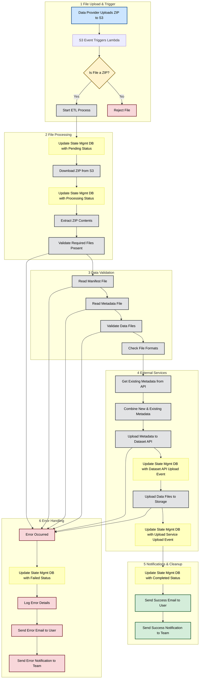

# ETL Lambda Process

```mermaid
graph TD
    subgraph "1 File Upload & Trigger"
        UploadZip[Data Provider Uploads ZIP to S3] --> TriggerLambda[S3 Event Triggers Lambda]
        TriggerLambda --> CheckFileType{Is File a ZIP?}
        CheckFileType -->|Yes| StartETL[Start ETL Process]
        CheckFileType -->|No| RejectFile[Reject File]
    end

    subgraph "2 File Processing"
        StartETL --> DatasetStatusPending[Update State Mgmt DB with Pending Status]
        DatasetStatusPending --> DownloadZip[Download ZIP from S3]
        DownloadZip --> DatasetStatusProcessing[Update State Mgmt DB with Processing Status]
        DatasetStatusProcessing --> ExtractZip[Extract ZIP Contents]
        ExtractZip --> ValidateFiles[Validate Required Files Present]
    end

    subgraph "3 Data Validation"
        ValidateFiles --> ReadManifest[Read Manifest File]
        ReadManifest --> ReadMetadata[Read Metadata File]
        ReadMetadata --> ValidateData[Validate Data Files]
        ValidateData --> CheckFormats[Check File Formats]
    end

    subgraph "4 External Services"
        CheckFormats --> GetExistingMetadata[Get Existing Metadata from API]
        GetExistingMetadata --> CombineMetadata[Combine New & Existing Metadata]
        CombineMetadata --> UploadMetadata[Upload Metadata to Dataset API]
        UploadMetadata --> MetadataUploadEvent[Update State Mgmt DB with Dataset API Upload Event]
        MetadataUploadEvent --> UploadDataFiles[Upload Data Files to Storage]
        UploadDataFiles --> DataUploadEvent[Update State Mgmt DB with Upload Service Upload Event]
    end

    subgraph "5 Notifications & Cleanup"
        DataUploadEvent --> DatasetStatusCompleted[Update State Mgmt DB with Completed Status]
        DatasetStatusCompleted --> SendSuccessEmail[Send Success Email to User]
        SendSuccessEmail --> SendSuccessNotification[Send Success Notification to Team]
    end

    subgraph "6 Error Handling"
        ValidateFiles --> ErrorOccurred[Error Occurred]
        ReadManifest --> ErrorOccurred
        ReadMetadata --> ErrorOccurred
        ValidateData --> ErrorOccurred
        UploadMetadata --> ErrorOccurred
        UploadDataFiles --> ErrorOccurred
        ErrorOccurred --> DatasetStatusFailed[Update State Mgmt DB with Failed Status]
        DatasetStatusFailed --> LogError[Log Error Details]
        LogError --> SendErrorEmail[Send Error Email to User]
        SendErrorEmail --> SendErrorNotification[Send Error Notification to Team]
    end

    %% Styling
    classDef success fill:#d4edda,stroke:#155724,stroke-width:2px,color:black
    classDef error fill:#f8d7da,stroke:#721c24,stroke-width:2px,color:black
    classDef process fill:#e2e3e5,stroke:#383d41,stroke-width:2px,color:black
    classDef decision fill:#fff3cd,stroke:#856404,stroke-width:2px,color:black
    classDef start fill:#cce5ff,stroke:#004085,stroke-width:2px,color:black
    classDef db fill:#ffffbf,stroke:#f0f075,stroke-width:2px,color:black

    class UploadZip start
    class SendSuccessEmail,SendSuccessNotification,MoveToProcessed,MarkComplete success
    class RejectFile,ErrorOccurred,LogError,SendErrorEmail,SendErrorNotification,MoveToFailed,MarkFailed error
    class CheckFileType decision
    class StartETL,DownloadZip,ExtractZip,ValidateFiles,ReadManifest,ReadMetadata,ValidateData,CheckFormats,GetExistingMetadata,CombineMetadata,UploadMetadata,UploadDataFiles process
    class DatasetStatusPending,DatasetStatusProcessing,MetadataUploadEvent,DataUploadEvent,DatasetStatusCompleted,DatasetStatusFailed db
```