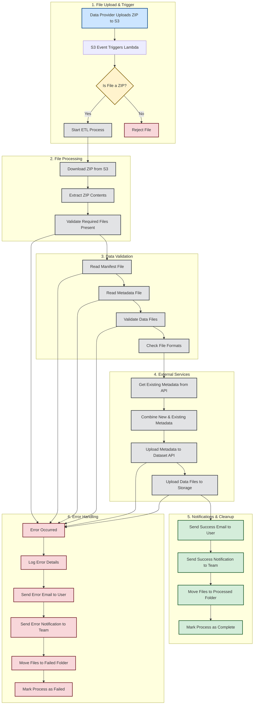

# ETL Lambda Process

```mermaid
graph TD
    subgraph "1. File Upload & Trigger"
        UploadZip[Data Provider Uploads ZIP to S3] --> TriggerLambda[S3 Event Triggers Lambda]
        TriggerLambda --> CheckFileType{Is File a ZIP?}
        CheckFileType -->|Yes| StartETL[Start ETL Process]
        CheckFileType -->|No| RejectFile[Reject File]
    end
    
    subgraph "2. File Processing"
        StartETL --> DownloadZip[Download ZIP from S3]
        DownloadZip --> ExtractZip[Extract ZIP Contents]
        ExtractZip --> ValidateFiles[Validate Required Files Present]
    end
    
    subgraph "3. Data Validation"
        ValidateFiles --> ReadManifest[Read Manifest File]
        ReadManifest --> ReadMetadata[Read Metadata File]
        ReadMetadata --> ValidateData[Validate Data Files]
        ValidateData --> CheckFormats[Check File Formats]
    end
    
    subgraph "4. External Services"
        CheckFormats --> GetExistingMetadata[Get Existing Metadata from API]
        GetExistingMetadata --> CombineMetadata[Combine New & Existing Metadata]
        CombineMetadata --> UploadMetadata[Upload Metadata to Dataset API]
        UploadMetadata --> UploadDataFiles[Upload Data Files to Storage]
    end
    
    subgraph "5. Notifications & Cleanup"
        UploadDataFiles --> SendSuccessEmail[Send Success Email to User]
        SendSuccessEmail --> SendSuccessNotification[Send Success Notification to Team]
        SendSuccessNotification --> MoveToProcessed[Move Files to Processed Folder]
        MoveToProcessed --> MarkComplete[Mark Process as Complete]
    end
    
    subgraph "6. Error Handling"
        ValidateFiles --> ErrorOccurred[Error Occurred]
        ReadManifest --> ErrorOccurred
        ReadMetadata --> ErrorOccurred
        ValidateData --> ErrorOccurred
        UploadMetadata --> ErrorOccurred
        UploadDataFiles --> ErrorOccurred
        ErrorOccurred --> LogError[Log Error Details]
        LogError --> SendErrorEmail[Send Error Email to User]
        SendErrorEmail --> SendErrorNotification[Send Error Notification to Team]
        SendErrorNotification --> MoveToFailed[Move Files to Failed Folder]
        MoveToFailed --> MarkFailed[Mark Process as Failed]
    end
    
    %% Styling
    classDef success fill:#d4edda,stroke:#155724,stroke-width:2px
    classDef error fill:#f8d7da,stroke:#721c24,stroke-width:2px
    classDef process fill:#e2e3e5,stroke:#383d41,stroke-width:2px
    classDef decision fill:#fff3cd,stroke:#856404,stroke-width:2px
    classDef start fill:#cce5ff,stroke:#004085,stroke-width:2px
    
    class UploadZip start
    class SendSuccessEmail,SendSuccessNotification,MoveToProcessed,MarkComplete success
    class RejectFile,ErrorOccurred,LogError,SendErrorEmail,SendErrorNotification,MoveToFailed,MarkFailed error
    class CheckFileType decision
    class StartETL,DownloadZip,ExtractZip,ValidateFiles,ReadManifest,ReadMetadata,ValidateData,CheckFormats,GetExistingMetadata,CombineMetadata,UploadMetadata,UploadDataFiles process
```