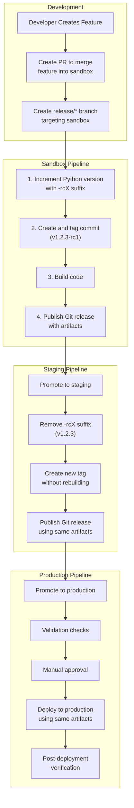
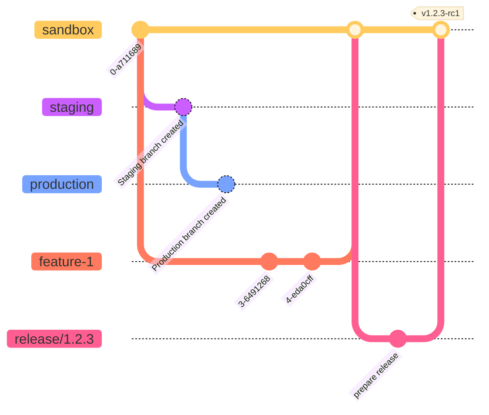

```mermaid
flowchart TD
    subgraph "Development"
        dev[Developer Creates Feature]
        pr[Create PR to merge\nfeature into sandbox]
        rel[Create release/* branch\ntargeting sandbox]
    end
    
    dev --> pr
    pr --> rel
    
    subgraph "Sandbox Pipeline"
        increment["1. Increment Python version\nwith -rcX suffix"]
        tag["2. Create and tag commit\n(v1.2.3-rc1)"]
        build["3. Build code"]
        publish["4. Publish Git release\nwith artifacts"]
    end
    
    rel --> increment
    increment --> tag
    tag --> build
    build --> publish
    
    subgraph "Staging Pipeline"
        promote_staging["Promote to staging"]
        remove_suffix["Remove -rcX suffix\n(v1.2.3)"]
        tag_staging["Create new tag\nwithout rebuilding"]
        publish_staging["Publish Git release\nusing same artifacts"]
    end
    
    publish --> promote_staging
    promote_staging --> remove_suffix
    remove_suffix --> tag_staging
    tag_staging --> publish_staging
    
    subgraph "Production Pipeline"
        promote_prod["Promote to production"]
        validation["Validation checks"]
        approval["Manual approval"]
        deploy_prod["Deploy to production\nusing same artifacts"]
        verify["Post-deployment\nverification"]
    end
    
    publish_staging --> promote_prod
    promote_prod --> validation
    validation --> approval
    approval --> deploy_prod
    deploy_prod --> verify
```

```mermaid
%%{init: { 'logLevel': 'debug', 'theme': 'base', 'gitGraph': {'showBranches': true, 'showCommitLabel':true,'mainBranchName': 'sandbox'}} }%%
gitGraph
    commit
    branch staging
    commit id: "Staging branch created"
    branch production
    commit id: "Production branch created"
    checkout sandbox
    branch feature-1
    checkout feature-1
    commit
    commit
    checkout sandbox
    merge feature-1
    branch "release/1.2.3"
    checkout "release/1.2.3"
    commit id: "prepare release"
    checkout sandbox
    merge "release/1.2.3" tag: "v1.2.3-rc1"
```
